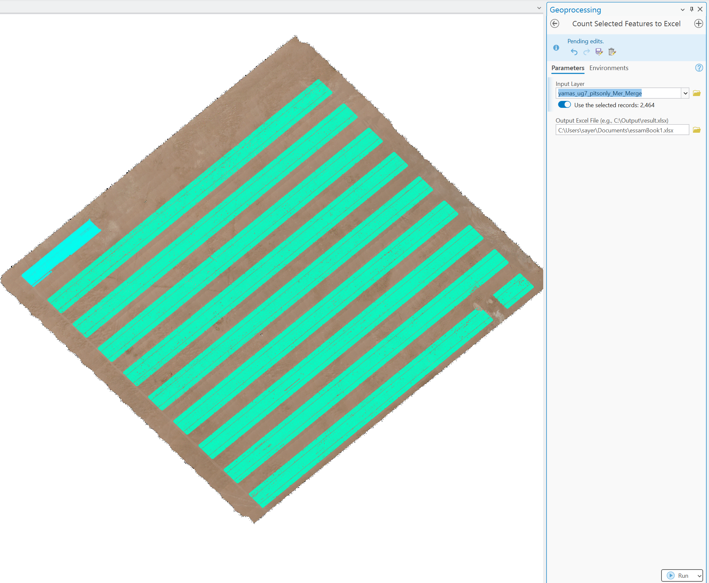

# CountSelectedToExcel
ArcGIS Pro Python Toolbox (`.pyt`) to export **selected feature count** to **Excel (.xlsx)** — built for fast reporting and validation of AI/deep learning detections (e.g., Mask R-CNN).

---

## 📌 Overview

When preparing reports from **AI/deep learning feature detection**, it’s often necessary to export key statistics (like the number of detected objects) into Excel for calculations and field reporting.

This toolbox solves a common ArcGIS Pro workflow problem: **quickly logging selection-based feature counts to an Excel `.xlsx` file**.

---

## 🚀 Key Features

✅ Counts **currently selected** features from a layer in ArcGIS Pro  
✅ Works with **shapefiles** and **geodatabase feature classes** (feature layers)  
✅ Writes results to Excel as:

- **Column A:** `Row1`, `Row2`, `Row3` …
- **Column B:** selection count

✅ **Output Folder** parameter (no need to type a full `.xlsx` path every time)  
✅ **Auto Excel filename** based on the layer name (you can override it)  
✅ **Append / Overwrite** mode  
✅ Optional **Notes** field per log entry  
✅ Optional **Include Details** mode (adds **Layer name + Timestamp** columns)  
✅ **Auto-detect selected layer** if *Input Layer* is left empty (finds the first layer with a selection)  
✅ If Excel is open/locked, the tool saves a safe copy:
`*_LOCKED_YYYYMMDD_HHMMSS.xlsx` (instead of failing)

---

## 🧪 Use Cases

- **Germination rate calculations**  
  `Germination % = (Detected plants) / (Total planting pits) × 100`

- Tracking planting success across farms  
- Validating deep learning outputs  
- Exporting field statistics for scientific documentation  
- Afforestation / revegetation / restoration project metrics  

---

## 🛠️ How to Use

1. Add the toolbox to ArcGIS Pro:  
   `CountSelectedToExcelToolbox_v2.pyt`

2. Select features in your layer (using Select tools).

3. Run the tool: **Count Selected Features to Excel**

4. Choose:
   - **Input Layer** (or leave empty to auto-detect)
   - **Output Folder**
   - (Optional) **Output Excel Name**
   - **Write Mode**: Append / Overwrite
   - (Optional) **Notes**
   - (Optional) **Include Details**

5. Click **Run** ✅

---

## ⚙️ Parameters (Tool UI)

- **Input Layer (optional):** Feature layer with selected features  
  If empty → tool auto-detects the first layer with a selection.

- **Output Folder (required):** Folder where the `.xlsx` will be saved.

- **Output Excel Name (optional):** Excel filename (default is the layer name).

- **Write Mode:**
  - **Append** → adds a new row each run
  - **Overwrite** → starts fresh (recreates/clears output sheet)

- **Notes (optional):** Any text saved with the selection event (plot ID, field name, etc.)

- **Include Details (True/False):**  
  If enabled, Excel will include extra columns:
  - Notes
  - Layer name
  - Timestamp

---

## 📄 Excel Output Format

### Default (Simple Mode)
| A (Row Label) | B (Count) |
|---|---:|
| Row1 | 6931 |
| Row2 | 6025 |
| Row3 | 4469 |

### With “Include Details” Enabled
| Row Label | Count | Notes | Layer | Timestamp |
|---|---:|---|---|---|
| Row1 | 6931 | Plot A | f13-ug6-A-plants | 2025-12-14 10:31:04 |

---

## 🧩 Requirements

- ArcGIS Pro (Python 3 / ArcPy)
- `openpyxl` for Excel writing  
  If missing: install via **ArcGIS Pro → Package Manager**

---

## 🧯 Troubleshooting

**Excel file is open and tool can’t write:**  
✅ Tool automatically saves a new safe-copy file with:  
`_LOCKED_YYYYMMDD_HHMMSS.xlsx`

**Count is always 0:**
- Ensure the selection exists on the chosen layer
- If using auto-detect, ensure only one layer has a selection (or select the correct layer explicitly)

---

## 📸 Screenshots



---

## 🔗 Citation

If you use **CountSelectedToExcel** in a report, publication, or academic work, please cite it:

**Suggested citation (APA-style):**  
*MassiveDynamics SD.* (2025). *CountSelectedToExcel: ArcGIS Pro Python Toolbox to export selected feature count to Excel* [Software]. GitHub.  
https://github.com/massivedynamics-sd/CountSelectedToExcel

### BibTeX
```bibtex
@software{CountSelectedToExcel_2025,
  author  = {MassiveDynamics SD},
  title   = {CountSelectedToExcel: ArcGIS Pro Python Toolbox to export selected feature count to Excel},
  year    = {2025},
  url     = {https://github.com/massivedynamics-sd/CountSelectedToExcel},
  note    = {Accessed: YYYY-MM-DD}
}
