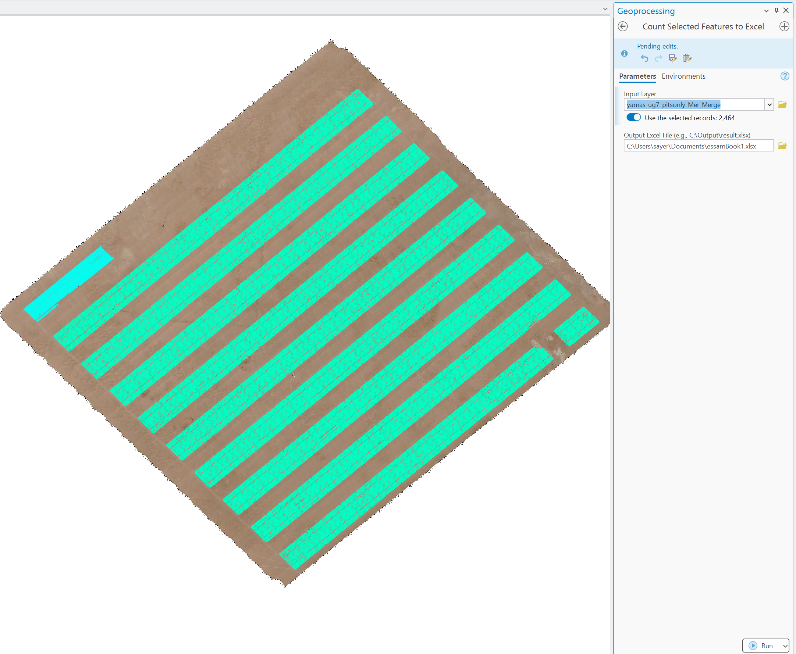

# CountSelectedToExcel
ArcGIS Pro Python Toolbox to export selected feature count to Excel.
# 🧮 Count Selected Features to Excel – ArcGIS Python Toolbox

This ArcGIS Pro Python Toolbox allows you to **count the selected features** in any shapefile or feature layer and **export the result to an Excel file** automatically.

---
# 🌾 ArcGIS Tool: Count Selected Features to Excel

This ArcGIS Python Toolbox (`.pyt`) and Model Tool (`.tbx`) allows you to **count selected features** in a feature layer and **export the count directly to an Excel file**. It is specifically designed to assist with **AI-powered agricultural analysis**, such as calculating **germination rate**, **planting success rate**, or validating outputs from deep learning models.

---

## 📌 Why This Tool?

When preparing reports based on **artificial intelligence (AI)**, particularly **deep learning-based feature detection**, it is often necessary to export key statistics (like the number of detected objects) for use in calculations or field reports.

I developed this tool to solve the challenge of quickly exporting **selection-based feature counts** from ArcGIS Pro to **Excel spreadsheets**, which are commonly used for:
- Agricultural reports
- Field success tracking
- Germination rate calculations
- Afforestation project metrics

---

## 🚜 Key Features

✅ Count selected features in any shapefile or feature class  
✅ Save the count as rows in an Excel `.xlsx` file  
✅ Supports GDB layers, shapefiles, or joined tables  
✅ Works with AI-based feature detection layers (e.g., Mask R-CNN)  
✅ Option to overwrite or append to Excel file  
✅ Choose custom output Excel path  
✅ Compatible with ArcGIS Pro (Python 3)

---

## 🧪 Use Cases

- Calculate **germination rate**:  
  *`Germination % = (Number of plants detected) / (Total planting pits) × 100`*

- Track **planting success** across large-scale farms  
- Validate **deep learning outputs** for agricultural or forestry use  
- Export field-level statistics for scientific documentation  
- Use in **revegetation**, **desert afforestation**, or **soil restoration** projects

---

## 📦 Features

- Works with shapefiles and geodatabase layers.
- Exports the number of selected features to Excel (.xlsx).
- Excel file is named after the input layer.
- Starts fresh each time — previous results are not appended.
- Ideal for use in agricultural projects, environmental monitoring, and any spatial data analysis.

---

## 🛠️ How to Use

1. **Add the toolbox** to ArcGIS Pro (`CountSelectedToExcelToolbox_v2.pyt`).
2. Select any features in your map layer.
3. Open the toolbox tool: **Count Selected Features to Excel**.
4. Choose the input layer from the dropdown.
5. Choose the output location for the Excel file.
6. Click **Run**.

If no features are selected, the tool will still create the Excel file with a value of `0`.

---

## 📁 Output Example

Each Excel file contains only:
| Row # | Selected Count |
|-------|----------------|
| 1     | 9432           |

---

## 📸 Screenshots

---

## 🎥 Video Explanation

📺 [Watch Video Guide](assets/demo.mp4) *(Add this to your repo if available)*

---

## 📜 License

This project is licensed under the [MIT License](LICENSE).

---

## 🙏 Acknowledgments

Special thanks to [Sayer] for the field integration, and to Mr. Sabary for support in testing.

---

## 💬 Feedback or Issues?

Feel free to submit issues or improvements via GitHub Issues.

